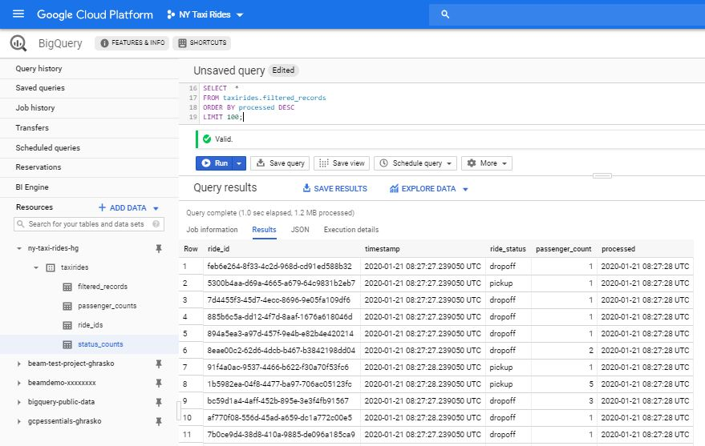

Gábor Hraskó

# Streaming data analysis with Google DataFlow

This is a demonstration project that uses various Google Cloud Project functionalities (**PubSub**, **DataFlow**, **BigQuery** etc.) for the analysis of a high data volume stream: *NYC Taxi and Limousine Commission Trip Record Data*. This datastream is provided through a PubSub topic: **projects/pubsub-public-data/topics/taxirides-realtime**.

The tasks are as follows:

- Filter out potential duplicated messages
- Calculate the hourly number of taxi trips
- Calculate the number of passangers transported every hour
- Persist the calculated aggregate results

Solution steps:

1. Data exploration
2. Task interpretation and specification
3. Implementation
4. Testing
5. Cleanup

This document was created using GitHub's markup language. If your document viewer can't display the formatting correctly, read the document directly [on GitHub](https://github.com/ghrasko/nytaxirides/blob/master/README.md).

## Data exploration

To be able to overview the structure and volume of the streaming data, I set up a Google DataFlow job based on the template: [Pub/Sub Topic to BigQuery](https://cloud.google.com/dataflow/docs/guides/templates/provided-streaming#cloudpubsubtobigquery) and analysed the resulting BigQuery table. The high level conclusions are as follows:

| Topic | Analysis result |
|-------|-----------------|
|Message format|{<br>"ride_id":"ffff404d-205f-4639-a9ba-e0a1c0e59ee9",<br>"point_idx":156,<br>"latitude":40.758680000000005,<br>"longitude":-73.95870000000001,<br>"timestamp":"2020-01-19T09:50:56.57238-05:00",<br>"meter_reading":6.486022,<br>"meter_increment":0.041577064,<br>"ride_status":"pickup",<br>"passenger_count":5<br>}|
|Message ID|Stored in ride_id item. Not unique per message but per a complete transfer|
|Statuses|A complete transfer is broke down to three phases: pickup, enroute and dropoff. This status is stored in the ride_status item. Enroute messages are provided repeatedly during the transfer. For the pickup and dropoff messages the ride_id-ride_status pairs form a unique ID.|
|Data volume|10+ million messages per hour, cca. 3000 messages per second|
|Enroute status message frequency|> 99%|
|Pickup & Dropoff status messages|Cca. 0.5%, i.e.  15 messages to work on per seconds|
|Duplicates|No duplicates found among 100 000+ records of pickup and dropoff status.|
|Message timing|The messages contain source based timestamp. The DataFlow template does not insert a process timestamp into the datasink BigQuery table, but manual subscription checks suggest that the process lag is within a few seconds.|
|Invalid messages|The template flow did not provide information about the frequency of ill-formatted or incomplete messages, but the log files did not indicate bad messages in noticeable quantities.|
	
The incoming volume is large, but if we are able to retrieve and filter the incoming stream fast enough, the remaining volume does not seem to be problematic for data analysis.

Duplication does not seem to be a problem in this stream. In a real-life business situation (regarding reports about taxi rides) we might decide not to deal with it at all.

## Task interpretation and specification

#### Deduplication

We see that the expected frequency of duplication is very low. In fact we don’t see any duplication within the tested data flow. 

There could be two sources of duplication in a Pub/Sub environment:

1. Pub/Sub guaranties “at least once” delivery. It means that duplications might occur even if the source is perfect.
2. The source itself might publish the same message repeatedly, in which case those messages are absolutely different for Pub/Sub. Even if Pub/Sub handle them perfectly, the subscribers will receive duplicates.

Deduplication of high volume streams is a challenging task. Keeping track of duplicates is difficult even if a single process handles them, but if the job is distributed, it is really difficult.

Besides the sheer volume, there is a logical challenge with unbounded streams. Duplication checking should be bounded to a reasonable predefined time-frame as it would be practically impossible to identify a duplicate that had arrived much later than the original copy. 

#### Filter out “enroute” messages

If we could consume the incoming messages fast enough, filtering out the “enroute” messages would be a fast, straightforward task.

We might decide that ill-formatted or incomplete messages should also be filtered out. These events should be logged clearly for future analysis so that we should be able to adapt our algorithm if those occur in frequencies that are not tolerable by the business case.

#### Count “pickup” and “dropoff” status frequences hourly

It seems that we can process the messages with a few second delay (counted from their real origin datetime). As we should provide hourly aggregates, late arrival does not change the values too much.

Based on this technical parameter and based on the realistic business case expectations, we might use a fix, process time based windowing instead of event time based windowing. As the messages contain source timestamp, an improvement might be done later by introducing event time windowing and leave the window open for some 10-20 seconds after the hour to handle late messages.

#### Sum passengers hourly

The technical challenges are the same as for the counting. We should make a business decision whether to sum passengers based on the “pickup” or on the “dropoff” messages. I made the decision to use the “pickup” messages for this.

#### Persist the aggregations

There are 2 + 1 aggregated values per hour, so storing them anywhere is not a problem. It is a challenge however to ensure that the aggregations are not lost by a system or network failure during the hour or while writing out.

## Implementation

It could be an obvious decision to use the Google Pub/Sub SDK and implement the solution in an appropriate programming language, for example in Python. However the challenges regarding streaming, the large volume and the deduplication suggest that a robust higher level framework would be more efficient. I decided to go for Google DataFlow because of the following reasons:

* It is a fully managed serverless solution.
* It is capable of dynamically handling changing high data volumes. 
* It has streaming connector to Pub/Sub (as data source).
* When using with Pub/Sub streaming data source, it guaranties “Exactly-one processing”. See this three part documentation about the architecture: [Part 1](https://cloud.google.com/blog/products/gcp/after-lambda-exactly-once-processing-in-google-cloud-dataflow-part-1), [Part 2](https://cloud.google.com/blog/products/gcp/after-lambda-exactly-once-processing-in-cloud-dataflow-part-2-ensuring-low-latency), [Part 3](https://cloud.google.com/blog/products/gcp/after-lambda-exactly-once-processing-in-cloud-dataflow-part-3-sources-and-sinks). Pub/Sub “at least once” challenge is managed automatically based on Pub/Sub’s own unique message ID. Also DataFlow provides automatic means to deduplicate using source based message IDs. Though this is very promising, we don’t have a single field unique ID in this case. Furthermore, we learnt from manual tests, that this source based deduplication seems not working with the Python SDK. 
* It has streaming connector to BigQuery (as data sink). A very safe “exactly once writing” algorithm can be implemented if needed (I had not done this) based the strategy mentioned in the [Exactly Once Sinks](https://cloud.google.com/blog/products/gcp/after-lambda-exactly-once-processing-in-cloud-dataflow-part-3-sources-and-sinks) chapter of Part 3 of the above mentioned article.
* It has an SDK for Python, but if there is any problem, the solution could be easily ported to another language.
* It has a stand-alone runner (DirectRunner) that makes development and debugging easier.

#### Solution overview

I implemented a Google DataFlow-based solution in Python 3. In my own GCP project I created a Pub/Sub subscription that is connected to the very same public streaming topic. I used BigQuery tables to persist the aggregation results and also to save filtered raw data for manually testing the aggregation results. The complete source package with implementation instructions is uploaded to GitHub: [ghrasko/nytaxirides](https://github.com/ghrasko/nytaxirides). The [Environment configuration steps](#environment-configuration-steps) chapter at the end of this document provides step-be-step instructions about setting up the environment for this project.

During the pipeline definition I balanced between efficiency and clarity. Several improvements could be done in the code, but this version demonstrates the structure rather clearly. The screenshot below shows the pipeline on the DataFlow Job page.


Jobs can't be deleted in DataFlow, thus job names can't be "re-used". That's why the program generates unique job names for each run by appending timestamp after the base name defined on the command line parameter --jobname. The screenshot below shows the DataFlow Job list page with the single active and multiple stopped (cancelled) jobs.


  
The message back-log is between 4-5000 as shown on the following diagram.


  
The age of the oldest unacknowledged message is below 5 seconds as shown in the floowing diagram:


  
If the --raw_data flag is provided on the command line, the program also stores the filtered (“pickup” and “dropoff”) messages. The custom implemented deduplication happens after this point, so this table should contain duplicates - if there are any. Not like the standard template, I added a “processed” timestamp and could check that the overall process time is within a few seconds (generally below one second). That is why the simple and strict process time based windowing introducing negligible accuracy degradation. The BigQuery screenshot below shows the recent top content of the filtered_records table.



The number of “pickup” and “dropoff” messages were around 18 000 each between 7 and 8 AM as shown in the BigQuery screenshot below The time window length can be defined via the --window_length command line parameter. The below query result shows the referenced one hour window and also several 60 second long window results that were generated during previous test runs.


In the same one hour period (7 - 8 AM) 29 141 passengers were reported based on the “pickup” messages as shown below. This BigQuery screenshot also shows earlier 60 second long window results as well.


As a cross-check we can query the passenger count summary from the saved raw data as well and it also gives the same result: 29 141.

```SQL
SELECT SUM(passenger_count)
FROM taxirides.filtered_records 
WHERE (ride_status = 'pickup') AND (timestamp > '2020-01-21 07:00:00 UTC') AND (timestamp <= '2020-01-21 08:00:00 UTC')
```

#### Deduplication

As I mentioned in my analysis, deduplication is not a trivial task and every streaming implementation has to live with some compromise. It should be checked if the compromise is acceptable in the specific business case.

The deduplication algorithm I implemented is based on some assumption about the architecture of Beam and has some limitations, known leakings:

- Streaming duplication checking is generally based on some time window (a limit in the past of the stream). In my implementation this limit is the current one hour window, i.e. it checks for duplications within the actual window only. Some duplicates that arrive after the closing of the actual window, will not be filtered out as those will appear in the next window. See possible enhancement options at the end of this chapter.
- My solution is based on the assumption that though Beam might repeatedly execute the deduplication VTransform step with the same VCollection or with VCollections with overlapping message sets, finally only one resulting sets will “win” and proceed to the next pipeline step. In fact, I believe that using the proposed windowing strategy even this will not happen. 
- The solution might run out of memory with even bigger datasets or with longer - for example 24 hour - window length.

If we want to check for duplicates during single message operations, we must maintain a global list of IDs. If, however, we do this during aggregation steps, the ride_id-s are provided for us by DataFlow pipeline itself.

The TotalGroupField()  routine summarizes a field (in this example the passenger_count field) on the provided element[‘records’] list. If we are not dealing with duplicates, the summarization step is a single liner:

```Python
total = sum(record[element_key_name] for record in records)
```

If the --custom_deduplication parameter is provided on the command line, this routine sets up a set of ride_id-s and sums every repeated record once. In the following code fragment the value of element_key_name is “passenger_count”.

```Python
ids = set()
duplicates = 0
total = 0
for record in records:
    id = record['ride_id']
    if id in ids:
        duplicates += 1
    else:
        ids.add(id)
        total += record[element_key_name]
```

This solution is fast enough, and in this scenario it does not require too much memory. CountGroups() routine count records similarly by skipping possible duplicates.

There are potential enhancement directions to cope with the above mentioned limitations. As we are dealing with deduplication only at the aggregating VTransform steps that run relatively infrequently (triggered at the end of windows), a careful lookup table writing/reading to and from persistence storage might be acceptable time cost. This way we might extend the content of our in-memory pickup table - presently a set - with data from some past time windows. Or we might use [Bloom filters](https://en.wikipedia.org/wiki/Bloom_filter) to reduce reading checks. The cited document about deduplication describes some Boom filter strategies used by Beam itself in more complex windowing situations. However, we must have to be very careful, as writing and reading to/from external sources in an aggregation step is a side effect that might influence algorithm consistency.

## Deployment

When launching the program using the DataFlow runner, the pipeline code is automatically deployed to a new virtual machine in GCP. This dictates some special rules when structuring the source code and related other files. Basically we should create our application as a Python module that could be installed into the newly initiated cloud based VM. Information about the requirements are provided in the following GCP document: [Multiple File Dependencies](https://beam.apache.org/documentation/sdks/python-pipeline-dependencies/#multiple-file-dependencies). Though it makes life a bit more complex, I intentionally broke the code down into several source files to separate functionally different code fragments. The description of each files are described here:

|File/folder|Description|
|-----------|-----------|
|.\nytaxirides\__init__.py|Empty file signalling that this is a Python module folder|
|.\nytaxirides\taxi.py|Command line argument parsing and Pub/Sub message queue purging.|
|.\nytaxirides\pipeline.py|The implementation of the Beam pipeline. This structure is presented on the GCP DataFlow job page in GCP Console as it is shown on the job screenshot presented earlier.|
|.\nytaxirides\transform.py|The code of the pipeline transactions that are not implemented as simple lambda function within the pipeline code. The two aggregation routines using deduplication can be found in this file.|
|.\.gitignore|Contains list of files ignored by Git.|
|.\LICENSE|Required licence information.|
|.\README.cmd|This file. Description of the project|
|.\setup.py|Python package description. Information in this file is also used by DataFlow to deploy the solution to the cloud.|
|.\taximain.bat|Optional Windows BAT file to activate the python virtual environment and run the application with a long list of command line parameters.|
|.\taximain.py|The short code launching the application as if it would use a package.|
	
Besides these files one should generate and download the Service Account key file as described in the READMO.txt file.

## Testing

There are two special circumstances that help testing:

- Besides the DataFlow runner, Beam supports the DirectRunner runner. If that is used, the application is not deployed to the cloud and the workflow runs on the development PC. This greatly helps debugging. However, using the DirectRunner has some disadvantages:
   - Some Beam features are not supported.
   - The data can’t be ingested fast enough, so the backlog is increasing continuously.
- I created a test Pub/Sub topic and a corresponding test subscription. If one sets the --subscription command line parameter to the test subscription name, the program will read messages that are manually posted. This way message format anomalies and (source) duplication can be simulated easily.

In Windfows environment start the program from the console by running the provided taximain.bat file. It activates the Python virtual environment and runs the application with a rich set of command line arguments:

```BAT
<path-to-your-python-virtualenv>\Scripts\activate
python taximain.py ..\.auth\taxirides-gcp-keys.json --setup_file .\setup.py --runner DataflowRunner --project your-globally-unique-projectid --subscription taxirides --window_length 60 --region us-central1 --staging_location gs://your-globally-unique-bucketname/binaries --temp_location gs://your-globally-unique-bucketname/temp --num_workers 1 --max_num_workers 2 --job_name taxiride --streaming --save_main_session --raw_messages --custom_deduplication --purge --loglevel 20 
```

In Unix you should activate the virtual environment a bit differently:

```bash
source <path-to-your-python-virtualenv>\bin\activate
python taximain.py ..\.auth\taxirides-gcp-keys.json --setup_file .\setup.py --runner DataflowRunner --project your-globally-unique-projectid --subscription taxirides --window_length 60 --region us-central1 --staging_location gs://your-globally-unique-bucketname/binaries --temp_location gs://your-globally-unique-bucketname/temp --num_workers 1 --max_num_workers 2 --job_name taxiride --streaming --save_main_session --raw_messages --custom_deduplication --purge --loglevel 20
```

Description of the command line parameters is as follows:

|parameter|Description|
|---------|-----------|
|Credential file|GCP JSON credentials file name with path|
|--purge |Purge pending messages before starting|
|--raw_messages|Save raw messages in the BigQuery taxirides.filtered_records table. If parameter is omitted, raw records will not be stored.|
|--window_length|Length of the fix, non-shifting data aggregation window given in seconds. The default is 3600 seconds (i.e. one hour)|
|--custom_deduplication|If provided, the program will apply the custom algorith to filter out duplicated messages.|
|--loglevel|Log level as integer. Standard values are as follows: NOTSET=0, DEBUG=10, INFO=20, WARNING=30, ERROR=40, CRITICAL=50. The default value is 20 (INFO) and you can use values other than these ones to refin the debug level.|
|--subscription|Name of PubSup subscription where the program reads messages. Default = taxiride. During standard implementation we also set up a topic = test and linked subscription = test that can be used to test the application by feeding it will manually posted messages.|
|--project|Name of the Cloud project owning the Dataflow job.|
|--runner|Pipeline runner used to execute the workflow. Valid values are DirectRunner and DataflowRunner.|
|--streaming|Signing that DataFlow should expect streaming (not batch) data. ALWAYS USE THIS FLAG ON THE COMMAND LINE!|
|--save_main_session|Save the main session state so that pickled functions and classes defined in __main__ (e.g. interactive session) can be unpickled. Some workflows do not need the session state if for instance all their functions/classes are defined in proper modules (not __main__)' and the modules are importable in the worker. ALWAYS USE THIS FLAG ON THE COMMAND LINE!|
|--region|us-central1. The Google Compute Engine region for creating Dataflow job. Change this parametr only if you know what you are doing!|
|--staging_location|GCS path for staging code packages needed by workers. Use the bucket name you had created during GCP environment setup in the form: gs://your-globally-unique-bucketname/binaries|
|--temp_location|GCS path for saving temporary workflow jobs. Use the bucket name you had created during GCP environment setup in the form: gs://your-globally-unique-bucketname/temp|
|--job_name|Base name of the Cloud Dataflow job. The program will add a '-YYYYMMDD-HHmmSS' timestamp prefix for this name to provide a unique job name.|
|--num_workers|Number of workers to use when executing the Dataflow job. If not set, the Dataflow service will use a reasonable default. One worker will be quite enough for this job.|
|--max_num_workers|Maximum number of workers to use when executing the Dataflow job. 1 is quite OK for this job, but you might play with 2|
|--setup_file|Path to a setup Python file containing package dependencies. If specified, the file\'s containing folder is assumed to have the structure required for a setuptools setup package. The file must be named setup.py. More details: https://pythonhosted.org/an_example_pypi_project/setuptools.html. During job submission a source distribution will be built and the worker will install the resulting package before running any custom code. Keep this as provided during the installation if you use the standard directory structure for the project!|

The --debuglevel command line parameter can be used to set the debug level. Anyhow, when deploying to the cloud (using DataFlow runner) the Job’s Step Log pane shows logs and the detailed logs can be managed from the Stackdriver. Below I show some log messages generated by the application.

When posting a non JSON message (in this test 'sdfsdfsdfsdfsdfs') through the test Pub/Sub topic, the process() routine in transform.Interpret() class catches the JSON parsing exception and logs this:

```
2020-01-21 13:13:27.513 CET Poorly-formed message, not JSON: b'sdfsdfsdfsdfsdfs' Expecting value: line 1 column 1 (char 0)
```

Invalid message formats or missing message items cause this log entry:

```
2020-01-21 13:15:05.929 CET Message lacks obligatory attributes: b'{\n "ride_id":"ffff404d-205f-4639-a9ba-e0a1c0e59ee9",\n "point_idx":156,\n "latitude":40.758680000000005,\n "longitude":-73.95870000000001,\n "meter_reading":6.486022,\n "meter_increment":0.041577064,\n "ride_status":"pickup",\n "passenger_count":5\n}' 'timestamp'
```

The aggregation routines generate one log line when triggered at the end of each time window about the number of filtered duplicates:

```
2020-01-21 13:13:06.903 CET TotalGroupField() dropped 2 duplicate messages
2020-01-21 13:15:06.471 CET CountGroups() dropped 2 duplicate messages
```

The BigQuery taxirides.filtered_records table contains the “pickup” and “dropoff” records read from the subscription. No custom deduplication is performed before writing out these records, but the non-interesting fields (columns) are omitted. The content of this table can be used for various test purposes:

- Checking general message content 
- Comparing queried aggregation values with the program generated aggregation results stored in passenger_counts and status_counts table records.
- Checking for duplications.
- Checking for distribution of process time and source time difference.
- Checking for other data anomalies that could generate new test scenarios and initiate code changes.

Remember that ride_id in itself is not a unique ID. It should be used together with the ride_status field to get a uniqu ID. You might look for dropoff record duplicates by issuing the following SQL command in BigQuery. It shows the total number of matching records and the distinct number. If the distinct number is smaller than the total number than ther are duplicates in the list.

```SQL
#standardSQL
SELECT COUNT(DISTINCT ride_id) AS distinct_recno, COUNT(ride_id) AS all_recno
FROM taxirides.filtered_records
WHERE processed < CURRENT_TIMESTAMP AND ride_status = 'dropoff';
```

Some simple queries to list all three table are as follows:

```SQL
SELECT * 
FROM taxirides.passenger_counts 
ORDER BY window_end DESC
LIMIT 100;

SELECT * 
FROM taxirides.status_counts  
ORDER BY window_end DESC
LIMIT 100;

SELECT * 
FROM taxirides.filtered_records 
ORDER BY processed DESC
LIMIT 100;
```

## Clean-up

Keeping the built-up project with cancelled jobs will not imply high recurring costs. I highly recommend that you check your billing regularly.

You might avoid any further costs by deleting the project entirely. You can do that from the Console GUI or from the command shell:

```
gcloud projects delete <project-id>
```

# Environment configuration steps

In this chapter I describe the configuration of the environment that is necessary to build and run the program described in the document. The main steps are as follows:

1. Environment configuration on Google Cloud Platform. This requires registration at https://cloud.google.com/ and involves a few dollar costs, but it could be deducted from the 300 credit (equivalent of 300 USD) provided for beginners in GCP. In fact I used less than 5 credits during the whole project development and testing. I highly recommend to check the GCP pricing information and configure predefined budgets and budget alerts to avoid any unexpected monthy bills.
2. Python environment setup on the development PC (either a real physical PC, a configured VM in GCP or your default GCP VM that is automatically used when you enter into the GCP Cloud shell).
3. Clone the code from GitHub and comand line parameter configuration

#### GCP configuration

The following configuration steps can be done on the graphical GCP Console GUI. Hereby I provide script commands for the Cloud Shell. Copy the command block from here and past them directoy to the command shell. Using these commands the complete GCP setup can be done within some minutes. 

The only user specific configuration should be done at the very begining "export' section when you define your own custom parameters for 3 valuse:

- Project ID
- Storage bucket name
- Name containing GCP credential data. You have to change it only in some rather unusual situations.

```
# Project ID and bucket name should be globally unique
export PROJECTID=your-globally-unique-projectid
export BUCKETNAME=your-globally-unique-bucketname
export KEYFILE=taxirides-gcp-keys.json

# You don't have to bother with these parameters
# Location should be available for both Storage and BigQuery
export PROJECTNAME="NY Taxi Rides"
export SUBSCRIPTION=taxirides
export TESTTOPIC=test
export TESTSUBSCRIPTION=test
export DFLOCATION=us-central1
export BQLOCATION=us-east1
export BQDATASET=taxirides
export SERVICEACCOUNT=taxirides

# Create project. 
gcloud projects create $PROJECTID --name=$PROJECTNAME
gcloud config set project $PROJECTID
```

Linking the new project to a billing account can't be performed from the shell, but only from the GCP console: [Billing/My projects](https://console.cloud.google.com/billing/projects). Forgetting to enable billing on the project will cause hardly understandable runtime errors. If you see billing related messages in the error log/dump, check the mentioned page to the project - billing account link.

```
# Configure service account and download key file
gcloud iam service-accounts create $SERVICEACCOUNT
gcloud projects add-iam-policy-binding $PROJECTID \
    --member "serviceAccount:$SERVICEACCOUNT@$PROJECTID.iam.gserviceaccount.com" \
    --role "roles/owner"
gcloud iam service-accounts keys create $KEYFILE \
    --iam-account $SERVICEACCOUNT@$PROJECTID.iam.gserviceaccount.com
cloudshell download ./$KEYFILE 

# Setting up DataFlow service. Enabling API and
# creating Storage bucket for cloud DataFlow operation
gcloud services enable dataflow.googleapis.com
gsutil mb -c STANDARD -l $DFLOCATION -b on gs://$BUCKETNAME/

# Setting up subscription for the streaming data
gcloud services enable pubsub.googleapis.com 
gcloud pubsub subscriptions create projects/$PROJECTID/subscriptions/$SUBSCRIPTION \
    --topic=projects/pubsub-public-data/topics/taxirides-realtime \
    --ack-deadline=60 \
    --message-retention-duration=6h
# Setting up test topic and subscription for manual testing
gcloud pubsub topics create projects/$PROJECTID/topics/$TESTTOPIC
gcloud pubsub subscriptions create projects/$PROJECTID/subscriptions/$TESTSUBSCRIPTION \
    --topic=projects/$PROJECTID/topics/$TESTTOPIC \
    --ack-deadline=60 \
    --message-retention-duration=6h

# Creating BigQuery dataset and tables
bq mk -d --data_location=$BQLOCATION $BQDATASET
bq mk --table $BQDATASET.filtered_records \
    ride_id:STRING,timestamp:TIMESTAMP,ride_status:STRING,passenger_count:INT64,processed:TIMESTAMP
bq mk --table $BQDATASET.passenger_counts \
    sum_passengers:INT64,window_start:TIMESTAMP,window_end:TIMESTAMP
bq mk --table $BQDATASET.status_counts \
    ride_status:STRING,count:INT64,window_start:TIMESTAMP,window_end:TIMESTAMP
```

#### Python environment setup

I highly recommend that you implement the solution using a virtual Python environment instead of your PC's global Python installation.

I developed the solution on a Windows 10 PRO environment. For Unix users there will be slight differences in two areas:

- Python VM activation
- Program launch and some directory path references

The following commands should be run on the DOS/Unix prompt:

```BAT
python --version
:: Python 3.7.5
python -m venv nytaxirides
nytaxirides\Scripts\activate
pip list
:: Package    Version
:: ---------- -------
:: pip        19.2.3
:: setuptools 41.2.0
pip --version
:: pip 19.2.3 from c:\python\nytaxirides\lib\site-packages\pip (python 3.7)
python -m pip install --upgrade pip
:: ...
:: Successfully installed pip-19.3.1
pip install apache-beam[gcp]
pip list
:: Package                  Version
:: ------------------------ ----------
:: apache-beam              2.17.0
:: google-api-core          1.16.0
:: google-apitools          0.5.28
:: google-auth              1.10.1
:: google-cloud-bigquery    1.17.1
:: google-cloud-bigtable    1.0.0
:: google-cloud-core        1.2.0
:: google-cloud-datastore   1.7.4
:: google-cloud-pubsub      1.0.2
:: google-resumable-media   0.4.1
:: googleapis-common-protos 1.51.0
:: ...
```

#### Clone the code from GitHub

Source on GitHub: https://github.com/ghrasko/nytaxirides

